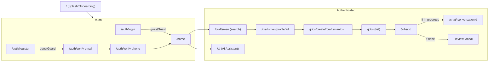
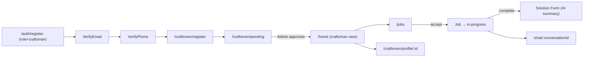
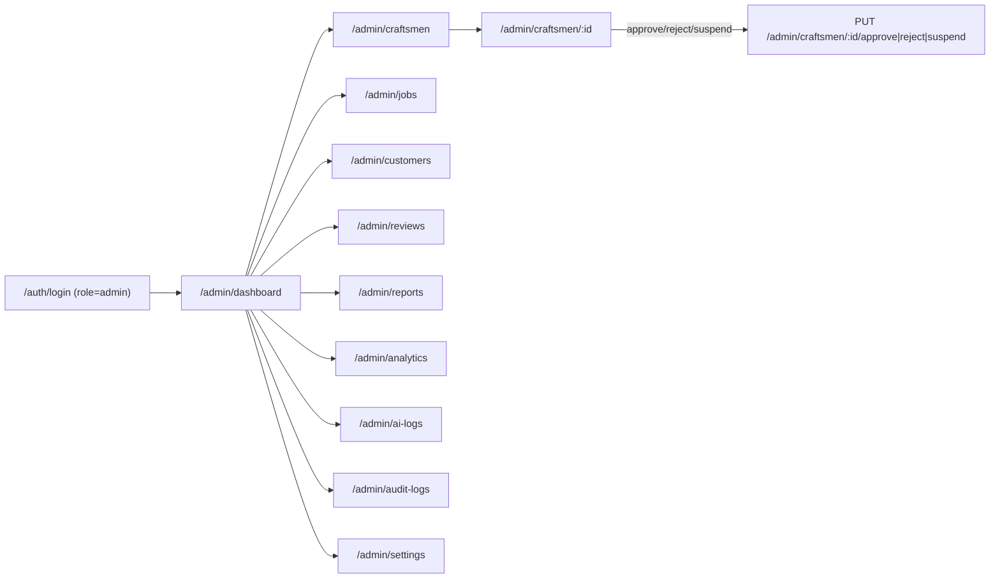
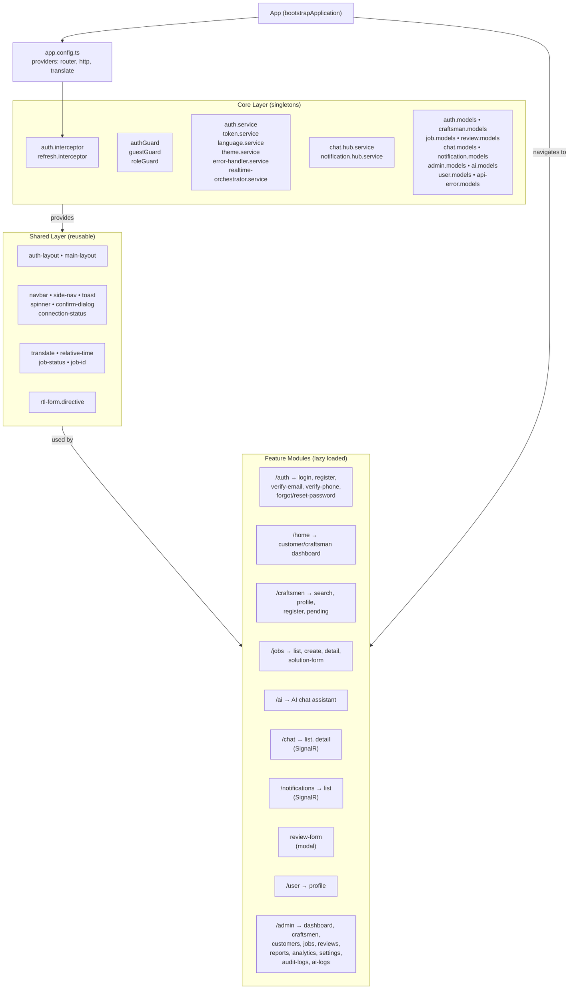

<div align="center">
  
  <h1 align="center">حرفي — Harfi</h1>
  <p align="center">
    <strong>Arabic-first platform connecting Egyptian customers with trusted, verified craftsmen</strong>
  </p>
  <p>
    <a href="https://angular.dev/" target="_blank"></a>
    <a href="https://www.typescriptlang.org/" target="_blank"></a>
    <a href="https://getbootstrap.com/" target="_blank"></a>
    
    <a href="LICENSE"></a>
    <a href="https://harfii.runasp.net/" target="_blank"></a>
  </p>
</div>

---

## Table of Contents

1. [Overview](#1-overview)
2. [Key Features](#2-key-features)
3. [User Journeys](#3-user-journeys)
4. [Architecture](#4-architecture)
5. [State Management & API Communication](#5-state-management--api-communication)
6. [Real-Time & AI-Streaming Features](#6-real-time--ai-streaming-features)
7. [RTL & Internationalization](#7-rtl--internationalization)
8. [Project Structure](#8-project-structure)
9. [Tech Stack](#9-tech-stack)
10. [Getting Started](#10-getting-started)
11. [Live Demo & Deployment](#11-live-demo--deployment)
12. [Team](#12-team)
13. [License](#13-license)

---

## 1. Overview

**Harfi (حرفي)** is a full-stack web platform connecting Egyptian customers with verified craftsmen. The frontend is an **Angular 21** single-page application using **standalone components** (no NgModules), **Bootstrap 5 RTL**, and **@ngx-translate** for Arabic-first bilingual i18n.

The frontend communicates with a **.NET Core Web API** backend over HTTP (REST) and **SignalR** WebSocket connections for real-time chat and notifications.

> **Live App:** [https://harfii.runasp.net/](https://harfii.runasp.net/)  
> **API (Swagger):** [https://harfi.runasp.net/index.html](https://harfi.runasp.net/index.html)

---

## 2. Key Features

| Feature | Implementation | Status |
|---------|---------------|--------|
| **Authentication** | JWT access/refresh tokens, email & phone OTP verification, password reset, role-based routing | ✅ Complete |
| **Craftsman Search** | Filter by service, city, rating, experience; debounced text search; sortable results; URL-shareable query params | ✅ Complete |
| **Craftsman Registration** | Role selection during sign-up, multi-field reactive form with file upload (national ID, profile photo), AI-assisted approval workflow | ✅ Complete |
| **Job Lifecycle** | Create → Open → Accept/Reject → Complete with status transitions, image upload, date/time scheduling | ✅ Complete |
| **Real-Time Chat** | SignalR-powered messaging with text, image, voice recording, location sharing; typing indicators, read receipts, online presence | ✅ Complete |
| **Notifications** | SignalR push + REST polling; unread badge counts; clickable notifications per type (new message, job accepted, review) | ✅ Complete |
| **AI Assistant** | RAG-based conversational search for craftsmen; image upload with vision analysis; session history; RAG feedback ("helped" / "need craftsman") | ✅ Complete |
| **Job Summary (AI)** | Craftsman submits problem/solution; backend AI validates and stores in ChromaDB vector store | ✅ Complete |
| **Reviews** | Star rating (1–5) + comment per completed job; reusable star display component | ✅ Complete |
| **Admin Panel** | Dashboard with charts, craftsman approval workflow, user management, job management, reviews moderation, reports, audit logs, AI sync, feature flags, analytics | ✅ Complete |
| **User Profile** | Editable name, phone, avatar image upload | ✅ Complete |
| **Dark / Light Mode** | CSS custom properties with `data-theme` attribute on `<html>` | ✅ Complete |
| **RTL / Arabic-first** | Default Arabic, English fallback; `dir` attribute toggling; separate font families per language | ✅ Complete |
| **Responsive Design** | Desktop sidebar layout, mobile bottom nav, responsive admin grid | ✅ Complete |

---

## 3. User Journeys

### Customer Flow



### Craftsman Flow



### Admin Flow



---

## 4. Architecture

### Module Structure

The app follows a **three-layer architecture** with lazy-loaded feature modules:



### Key Architectural Decisions

- **Standalone Components:** Zero NgModules; every component declares `standalone: true` and imports its dependencies directly.
- **Angular Signals** for reactive state (language, theme, notification counts, unread badges) over RxJS `BehaviorSubject` in most cases.
- **Functional Guards & Interceptors:** All guards and interceptors are plain functions (`CanActivateFn`, `HttpInterceptorFn`) using `inject()` for DI.
- **`inject()`-based DI** throughout — no constructor injection.
- **Lazy Loading:** All feature routes use `loadComponent()` or `loadChildren()` with dynamic `import()`.
- **OnPush Change Detection** on chat and notification components for performance.
- **No state management library** — services with signals and `localStorage` persistence suffice.

---

## 5. State Management & API Communication

### HTTP Interceptor Chain (in order)

| Order | Interceptor | Purpose |
|-------|------------|---------|
| 1 | `auth.interceptor.ts` | Attaches `Authorization: Bearer <token>` header to every outgoing request |
| 2 | `refresh.interceptor.ts` | On 403 (expired token): queues concurrent requests, calls `/auth/refresh`, retries with new token. On 429 (rate limit): shows Arabic toast. On refresh failure: clears session, redirects to `/auth/login`. |

### Route Guards

| Guard | Type | Logic | Redirect |
|-------|------|-------|----------|
| `authGuard` | `CanActivateFn` | `tokenService.isLoggedIn()` + `authService.loadCurrentUser()` (server-side validation) | `/auth/login` |
| `guestGuard` | `CanActivateFn` | Blocks authenticated users from login/register | `/home` |
| `roleGuard(['admin'])` | Factory → `CanActivateFn` | Checks `tokenService.getUser().role` | `/` |

### Core Services

| Service | File | Key Methods | Backend Endpoints |
|---------|------|-------------|-------------------|
| `AuthService` | `core/services/auth.service.ts` | `login()`, `register()`, `logout()`, `refreshToken()`, `verifyEmail()`, `verifyPhone()`, `forgotPassword()`, `resetPassword()`, `loadCurrentUser()` | `/api/auth/*` |
| `TokenService` | `core/services/token.service.ts` | `getAccessToken()`, `setUser()`, `isLoggedIn()`, `clearAll()` | localStorage management |
| `ErrorHandlerService` | `core/services/error-handler.service.ts` | `success()`, `error()`, `info()`, `handle(httpError)` | Toast event bus |
| `LanguageService` | `core/services/language.service.ts` | `switchTo()`, `toggle()`, `current` (signal) | Sets `<html dir/lang>` |
| `ThemeService` | `core/services/theme.service.ts` | `toggle()`, `current` (signal) | Sets `<html data-theme>` |

### Feature Services

| Service | Module | Key Methods | Backend Endpoints |
|---------|--------|-------------|-------------------|
| `CraftsmanService` | craftsman | `searchCraftsmen()`, `register()`, `getCraftsman()`, `updateCraftsmanProfile()`, `getActiveServices()`, `getActiveCities()` | `/api/craftsmen/*`, `/api/reviews/*` |
| `JobsService` | jobs | `createJob()`, `getCustomerJobs()`, `getCraftsmanJobs()`, `getJobById()`, `acceptJob()`, `rejectJob()`, `completeJob()`, `uploadJobImage()` | `/api/jobs/*` |
| `ChatService` | chat | `getConversations()`, `getMessages()`, `createConversation()`, `deleteConversation()`, `uploadImage()`, `uploadVoice()`, `deleteMessage()` | `/api/Conversations/*` |
| `NotificationsService` | notifications | `getAll()`, `getUnreadCount()`, `markAsRead()`, `markAllAsRead()`, `delete()`, `deleteAll()` | `/api/Notifications/*` |
| `ReviewsService` | reviews | `submitReview()`, `getCraftsmanReviews()`, `submitRagFeedback()` | `/api/reviews/*` |
| `AiService` | ai | `sendChat3()`, `analyzeMedia()`, `getSessions()`, `getSessionDetail()`, `deleteSession()` | `/api/AI/*` |
| `AdminService` | admin | 30+ methods for craftsman/user/job/review/report/analytics management | `/api/v1/admin/*` |
| `UserService` | user | `getProfile()`, `updateProfile()`, `uploadProfileImage()` | `/api/Users/*` |

---

## 6. Real-Time & AI-Streaming Features

### SignalR Hubs

| Hub | File | Hub URL | Events | Methods |
|-----|------|---------|--------|---------|
| `ChatHubService` | `core/hubs/chat.hub.service.ts` | `/hubs/chat` | `ReceiveMessage`, `UserTyping`, `MessagesRead`, `MessageDeleted`, `ConversationUpdated` | `sendMessage()`, `typing()`, `markAsRead()`, `deleteMessage()`, `joinConversation()`, `leaveConversation()` |
| `NotificationHubService` | `core/hubs/notification.hub.service.ts` | `/hubs/notifications` | `ReceiveNotification` | `connect()`, `disconnect()` |

Both hubs use `TokenService.getAccessToken()` as `accessTokenFactory` for authenticated connections and support automatic reconnection with exponential backoff.

### AI Chat (RAG Assistant)

The AI chat component (`features/ai/ai-chat`) provides:
- **Text chat** via `POST /api/AI/chat3` — sends user message, receives answer + retrieved craftsmen from vector store
- **Image analysis** via `POST /api/AI/analyze-media` — multipart upload (image + audio + text) to a vision endpoint
- **Session management** — history sidebar, session detail loading, delete
- **Conversation state machine** — intent selection, service/city extraction, follow-up steps
- **RAG feedback** — "ساعدني" / "محتاج حرفي" via `reviews.service.submitRagFeedback()`
- **Audio recording** — WhatsApp-style audio player with playback/seek

### Job Summary with AI Validation

After a craftsman marks a job as complete, they submit a problem solution description via `SolutionFormComponent`. This sends to `POST /api/AI/craftsman/check-and-submit-solution` which:
- Validates the summary content
- Rejects low-quality submissions with an error message
- Accepts and stores in ChromaDB on success

### Real-Time Notification Orchestration

`RealtimeNotificationOrchestratorService` (`core/services/realtime-notification-orchestrator.service.ts`) coordinates both SignalR hubs:
- Starts on `authGuard` activation (and in `App.ngOnInit` for pre-auth)
- On `ReceiveNotification`: deduplicates toasts via timestamp map, plays audio chime (Web Audio API), updates unread counts
- Emits `jobAccepted$` subject for real-time job list updates
- Stops on logout

---

## 7. RTL & Internationalization

### Approach

- **Default language:** Arabic (`'ar'`) with RTL layout
- **Library:** `@ngx-translate/core` v17 with `@ngx-translate/http-loader`
- **Translation files:** `src/assets/i18n/ar.json` (~870 keys) and `en.json` (~875 keys)
- **Configuration:** `provideTranslateService({ lang: 'ar', fallbackLang: 'en' })` in `app.config.ts`

### RTL Implementation

| Layer | Mechanism |
|-------|-----------|
| HTML element | `LanguageService` sets `dir="rtl"` / `dir="ltr"` and `lang="ar"` / `lang="en"` on `<html>` |
| Bootstrap | `angular.json` loads `bootstrap.rtl.min.css` (Bootstrap's official RTL build) |
| CSS selectors | `html[dir="rtl"]` and `html[dir="ltr"]` prefixes for layout overrides |
| Fonts | `Cairo` + `Tajawal` for Arabic, `Inter` for English |
| Forms | `RtlFormDirective` uses Angular `effect()` to set `textAlign`/`dir` on inputs based on language |
| Components | `:host-context([lang='en'])` and `:host-context([data-theme='dark'])` for scoped overrides |

### Theming

- **26 CSS custom properties** define the design token palette (`--brand-gradient`, `--bg-color`, `--text-primary`, etc.)
- Light theme: `:root[data-theme='light']` (default)
- Dark theme: `:root[data-theme='dark']` — overrides ~7 tokens
- Brand gradient: `linear-gradient(135deg, #8a2387, #e94057, #f27121)` (purple → red → orange)

---

## 8. Project Structure

```
harfi-frontend/
├── .env.development              # Local/remote API URL config
├── .env.production               # Production API URL config
├── angular.json                  # Angular CLI config (build: Vite/esbuild)
├── package.json                  # Dependencies & scripts
├── tsconfig.json                 # TypeScript config with path aliases
│
└── src/
    ├── index.html                # Root HTML (dir="rtl", Google Fonts, Material Icons)
    ├── main.ts                   # App bootstrap (bootstrapApplication)
    ├── styles.css                # Global CSS: custom properties, themes, utilities
    │
    ├── assets/
    │   ├── i18n/ar.json          # Arabic translations (870+ keys)
    │   ├── i18n/en.json          # English translations (875+ keys)
    │   └── images/               # Logo, icons, assets
    │
    ├── environments/
    │   ├── environment.ts        # Dev config (apiBaseUrl, hub URLs)
    │   └── environment.prod.ts   # Production config
    │
    └── app/
        ├── app.config.ts         # Global providers
        ├── app.routes.ts         # Root route definitions (all lazy)
        ├── app.ts                # Root component
        │
        ├── core/                 # ─── Singleton services, interceptors, guards, models
        │   ├── guards/           # auth.guard, guest.guard, role.guard
        │   ├── hubs/             # chat.hub.service, notification.hub.service (SignalR)
        │   ├── interceptors/      # auth.interceptor, refresh.interceptor
        │   ├── models/           # 10 model files (auth, user, craftsman, job, review,
        │   │                      #   chat, notification, api-error, ai, admin)
        │   └── services/         # auth, token, language, theme, error-handler,
        │                          #   realtime-notification-orchestrator
        │
        ├── shared/               # ─── Reusable UI
        │   ├── components/       # navbar, side-nav, toast, spinner, confirm-dialog,
        │   │                      #   connection-status
        │   ├── layouts/          # auth-layout (split-screen), main-layout (sidebar)
        │   ├── directives/       # rtl-form.directive
        │   └── pipes/            # translate (re-export), relative-time, job-status, job-id
        │
        └── features/             # ─── Lazy-loaded feature modules
            ├── auth/             # login, register, verify-email, verify-phone,
            │                      #   forgot-password, reset-password, splash
            ├── home/             # Customer/craftsman dashboard
            ├── craftsman/        # search, profile, register, pending, reviews
            ├── jobs/             # job-list, job-create, job-detail, solution-form
            ├── ai/               # AI chat assistant (vision, RAG, audio)
            ├── chat/             # chat-list, chat-detail (SignalR)
            ├── notifications/    # notification-list (SignalR)
            ├── reviews/          # review-form (modal)
            ├── user/             # user profile
            └── admin/            # dashboard, craftsmen, customers, jobs, reviews,
                                  #   reports, analytics, settings, audit-logs, ai-logs
```

---

## 9. Tech Stack

| Layer | Technology | Version | Purpose |
|-------|-----------|---------|---------|
| **Framework** | Angular | ^21.2.0 | SPA framework with standalone components |
| **Language** | TypeScript | ~5.9.2 | Type-safe JavaScript |
| **Build** | @angular/build (Vite/esbuild) | ^21.2.8 | Application builder |
| **Styling** | Bootstrap 5 RTL | ^5.3.8 | Responsive grid, utilities, components |
| **Icons** | Material Symbols (Google Fonts) | — | UI icon set |
| **i18n** | @ngx-translate/core | ^17.0.0 | Arabic/English translation |
| **i18n HTTP** | @ngx-translate/http-loader | ^17.0.0 | Fetches JSON translation files |
| **Real-time** | @microsoft/signalr | ^10.0.0 | WebSocket chat & notifications |
| **HTTP** | @angular/common/http | ^21.2.0 | HttpClient + functional interceptors |
| **Forms** | @angular/forms | ^21.2.0 | Reactive Forms + template-driven |
| **Charts** | chart.js | ^4.5.1 | Admin analytics charts |
| **Reactive** | rxjs | ~7.8.0 | Observables, operators |
| **CLI** | @angular/cli | ^21.2.8 | `ng serve`, `ng build` |
| **Formatter** | prettier | ^3.8.1 | Code formatting |

---

## 10. Getting Started

### Prerequisites

```bash
node -v          # >= 18.0
npm -v           # >= 9.0
ng version       # Angular CLI 21.2+
```

### Local Setup

```bash
# 1. Clone the repository
git clone <repo-url>
cd harfi-frontend

# 2. Install dependencies
npm install

# 3. Configure the backend URL
#    Edit src/environments/environment.ts (or use the .env files):
#    export const environment = {
#      production: false,
#      apiBaseUrl: 'http://localhost:5108/api',
#      chatHubUrl: 'http://localhost:5108/hubs/chat',
#      notificationHubUrl: 'http://localhost:5108/hubs/notifications',
#    };

# 4. Start the dev server
ng serve

# 5. Open in browser
#    http://localhost:4200
```

> ⚠️ The backend must be running for API calls to work. By default `environment.ts` points to the production backend (`https://harfi.runasp.net/api`). For local development, change it to your local backend URL.

### Production Build

```bash
ng build --configuration production
# Output: dist/harfi-frontend/browser/
```

### Environment Configuration

The app uses two environment files with identical shape but different values:

| Property | Prod (`environment.prod.ts`) | Dev (`environment.ts`) |
|----------|---------------------------|----------------------|
| `apiBaseUrl` | `https://harfi.runasp.net/api` | `https://harfi.runasp.net/api` |
| `chatHubUrl` | `https://harfi.runasp.net/hubs/chat` | `https://harfi.runasp.net/hubs/chat` |
| `notificationHubUrl` | `https://harfi.runasp.net/hubs/notifications` | `https://harfi.runasp.net/hubs/notifications` |

`.env.development` and `.env.production` files are also present but **not consumed by the build** — they serve as documentation for CI/CD pipeline values.

### Docker / Azure

The project does not include a `Dockerfile` in this repository. It is deployed on **runasp.net** (a free ASP.NET hosting platform) via direct upload of the `dist/` output.

---

## 11. Live Demo & Deployment

| Service | URL | Status |
|---------|-----|--------|
| **Frontend App** | [https://harfii.runasp.net/](https://harfii.runasp.net/) | ✅ Live |
| **Backend API (Swagger)** | [https://harfi.runasp.net/index.html](https://harfi.runasp.net/index.html) | ✅ Live |
| **Backend Repository** | [harfi-backend](https://github.com/harfi-team/harfi-backend) | Companion .NET Core API |

---

## 12. Team

| Name | Role | Responsibility |
|------|------|---------------|
| Esraa | Frontend Lead | Project structure, auth, routing, i18n, theme, core services |
| Hadeer | Frontend | Craftsman search, discovery & profiles |
| Habiba | Frontend | Booking system & job lifecycle |
| Mazen | Frontend | AI assistant & reviews |
| Ibrahim | Frontend | Real-time chat & notifications |

> This is an **ITI (Information Technology Institute)** graduation project — June 2026.

---

## 13. License

Distributed under the **MIT License**. See [LICENSE](LICENSE) for more information.
